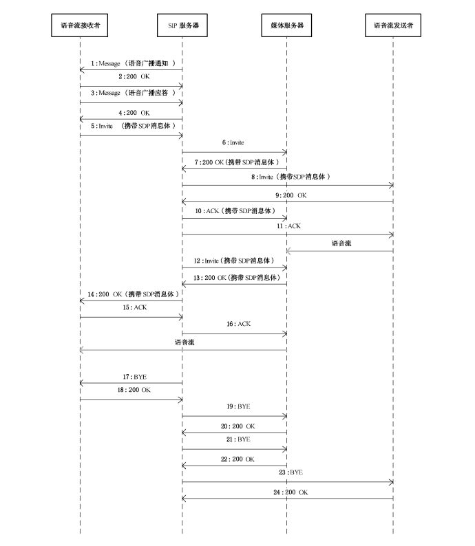

# 基于 socket 实现对 gb28181 设备发送广播

## 概述
语音广播功能实现用户从 `H5` 页面中获取到用户的语音输入，与后端建立 `websocket` 连接，实施将语音发送到服务器，后端通过前端传入的 `base64` 消息进行解码并分段存储成录音文件转换为 `g711a` 对设备进行发送。

### 广播发送时序图


### 语音广播通知、语音广播应答命令
消息头 Content-type字段为 Content-type:Application/MANSCDP+xml。
消息示例如下:

> 语音广播通知
``` xml
MESSAGEsip: 31010403001370002272@192.168.0.199:5511SIP/2.0
From: <sip:31010400002000000001 @ 3101040000>;tag = b05e7e60-ca00a8c0-1587-3a3-
7fb52a44-3a3
To:<sip:31010403001370002272@192.168.0.199:5511>
Call-ID: b05e7e60-ca00a8c0-1587-3a3-2b297f29-3a3@3101040000
CSeq: 1761796551MESSAGE
Via:SIP/2.0/UDP192.168.0.202:5511;rport;branch=z9hG4bK-3a3-e3849-287ef646
Max-Forwards: 70
Content-Type: application/MANSCDP+xml
Content-Length: 159
<? xmlversion="1.0" ?>
<Notify>
    <CmdType>Broadcast</CmdType>
    <SN>992</SN>
    <SourceID>31010400001360000001</SourceID>
    <TargetID>31010403001370002272</TargetID>
</Notify>

```
> 语音广播应答
``` xml
MESSAGEsip: 31010400002000000001@3101040000SIP/2.0
From: <sip:31010403001370002272@3101040300>;tag=b55b4cf8-c700a8c0-1587-a3-1ba9ac5-a3
To: <sip:31010400002000000000@3101040000>
Call-ID: b55b4cf8-c700a8c0-1587-a3-5eacf182-a3@3101040300
CSeq: 1856483244MESSAGE
Via: SIP/2.0/UDP192.168.0.199:5511;rport;branch=z9hG4bK-a3-27e0b-71dd2b33
Max-Forwards: 70
Content-Type: application/MANSCDP+xml
Content-Length: 143
<? xmlversion="1.0" ?>
<Response>
    <CmdType>Broadcast</CmdType>
    <SN>992</SN>
    <DeviceID>31010403001370002272</DeviceID>
    <Result>OK</Result>
</Response>
``` 
> SDP参数
```
v=0
o=6401060000202000000100 IN IP4 172.20.16.3
s=Play
c=IN IP4 172.20.16.3
t=00
m=audio 8000 RTP/AVP8 //标识语音媒体流内容
a=sendonly
a=rtpmap: 8 PCMA/8000 //RTP+音频流
y=0100000001
f=v/////a/1/8/1 //音频参数描述
```

目前此 `example` 仅对  `TCP` 在线，并且设备正在播放中的情况进行设备发起广播操作。对于设备厂商也只对 `海康` 的设备进行过测试。仅仅作为实现思路参考。

#### 如果此项目对您起到帮助，请给个 star。 

# 致谢
感谢作者 [xiangyuecn](https://github.com/xiangyuecn) 开源的Recorder用于html5录音项目，十分的好用。